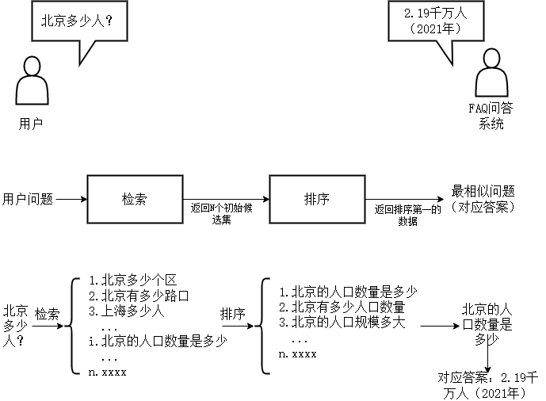
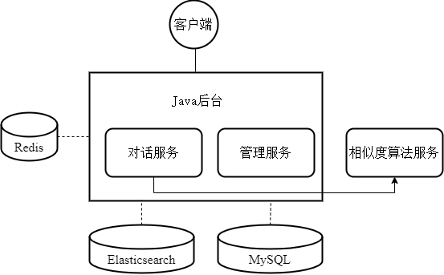
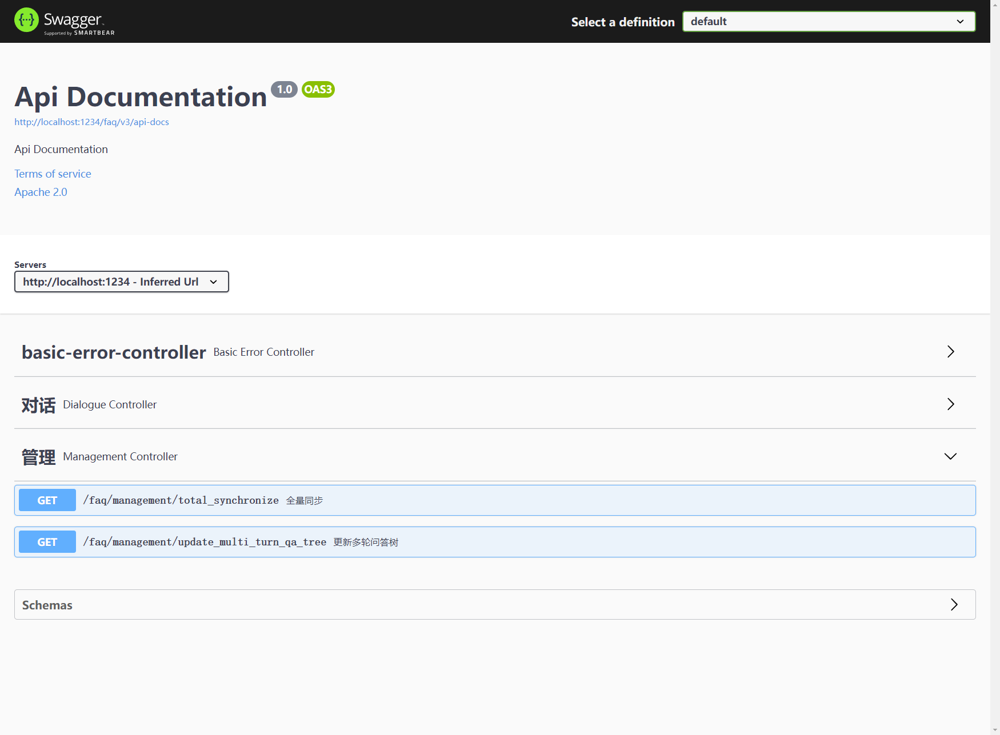
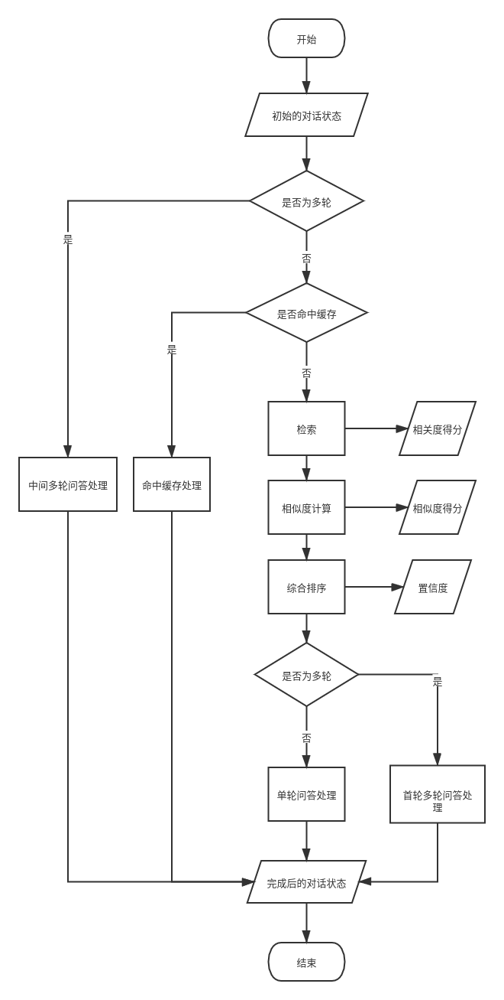
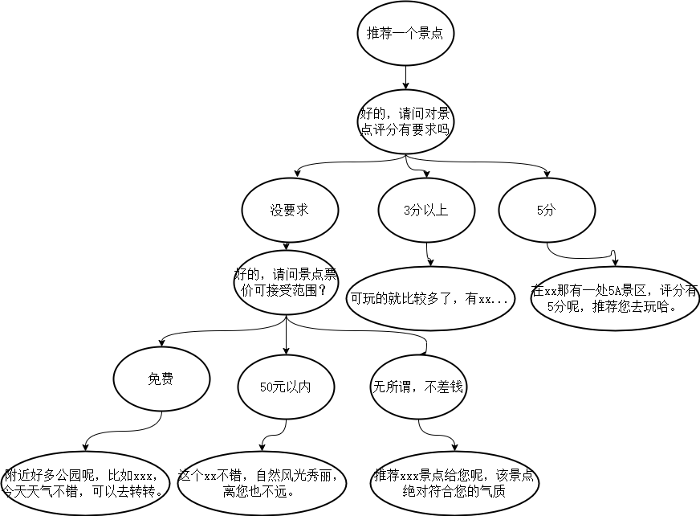

# 一、项目介绍

一个简单的FAQ问答系统实现。基于检索和排序的两阶段框架，检索阶段基于Elasticsearch检索引擎、排序阶段基于语义匹配深度学习模型。后端基于SpringBoot系列框架。

## 1.1 最简单的FAQ问答系统示意图

FAQ问答大概的对话流程示意图如下：



## 1.2 系统架构

系统的大致框架如下图所示：



以对话为例说一下系统各个模块的协同：

- 客户端带着`用户问题`向后台发送HTTP请求；
- 后台接受到请求，对`用户问题`进行ES检索，返回N（可配置）个相关的初始候选集；
- 后台通过HTTP请求调用相似度计算服务，对用户问题和N个候选句子一一成对进行相似度计算，返回它们的相似度；
- 后台结合ES相关度和模型相似度进行综合排序，取综合得分最高的结果对应的答案返回给前端；
- 前端显示；

值得一提的是，Redis的作用是对话状态管理，即每一个用户于系统交互都会在Redis中创建一个与之对应的对话状态（dialogue status），这个对话状态可以用来区分不同用户，也可以用来进行多轮对话（保存上一步对话的节点数据）。

# 二、功能说明

## 2.1 对话

对话是核心功能，提供一问一答的交互式方式。

**人机对话**：用户提出问题，系统给出回答。

## 2.2 数据同步

FAQ问答对持久化保存在MySQL中，管理员只需维护MySQL中的数据。但是在对话时，系统不会去访问MySQL，而是通过ES检索引擎进行检索。因此，保证MySQL和ES的数据一致非常重要。

**全量同步**：将MySQL中的问答对数据全部同步到ES索引中。
更新多轮问答树：多轮问答基于多轮JSON，逻辑上为树的组织结构，需要将JSON文件读取到Redis中存起来。

# 三、技术选型

## 3.1 后端

| 技术 | 说明                       |
| --- |--------------------------|
| Spring Boot | Java后端框架                 |
| Mybatis | Java持久层框架                |
| Rest high level client | Elasticsearch Java 客户端工具 |

除了上表之外，还用了lombok、Swagger2等框架。

## 3.2 数据库

| 技术 | 说明 |
| --- | --- |
| MySQL | 关系型数据库 |
| Redis | 缓存数据库 |
| Elasticsearch | 全文检索引擎 |

## 3.3 前端

| 技术     | 说明 |
|--------|--|
| ChatUI | Alibaba开源的对话UI |

前端语言主要为JS。

# 四、部署运行

## 4.1 环境搭建

### 4.1.1 MySQL

1. 建库

```shell
# 在mysql命令行执行下面建库语句
CREATE DATABASE IF NOT EXISTS faqdb DEFAULT CHARSET utf8 COLLATE utf8_general_ci;
```

3. 导入表数据

```shell
# 到sql/路径下，可以看faqdb.sql，在mysql命令行执行下面语句
source faqdb.sql;
```

### 4.1.2 Elasticsearch

关于ES的安装可以参考[我之前的文章](https://blog.csdn.net/qq_33187136/article/details/123906861)，如果嫌麻烦，可以直接下载我配置好分词器的ES。
```text
#百度云地址如下
链接：https://pan.baidu.com/s/13pz110aaeDsgPdfb_cSIeQ 
提取码：nazi
```

### 4.1.3 相似度算法

相似度算法是对话系统的关键组成部分，如果只是单纯的测试系统能不能跑起来，那可以先不管这部分。如果想要系统识别的准确度更高，最好关注一下相似度算法的配置，也可以使用自己的相似度计算模型。

本文也开源了基于百度ERNIE模型微改的相似度计算模型，基本上只是改变了模型的输入输出，并部署为可以接受HTTP请求的服务。开源地址如下：

[GitHub](https://github.com/lerry-lee/similarity-model)
[Gitee](https://gitee.com/lerry-lee/similarity-model)

## 4.2 启动步骤

### 4.2.1 启动MySQL、Redis、Elasticsearch

这三个数据库安装好以后就可以很简单的启动了，不再赘述。

### 4.2.2 启动Java后台

#### 4.2.2.1 启动前配置连接参数等

修改`application.yml`以更改应用、数据库等参数：
```yml
server:
  port: 1234
  servlet:
    context-path: /faq
spring:
  #mysql连接
  datasource:
    url: jdbc:mysql://localhost:3306/faqdb?characterEncoding=utf8&useSSL=false&serverTimezone=UTC
    username: root
    password: root
    driver-class-name: com.mysql.cj.jdbc.Driver
  mvc:
    throw-exception-if-no-handler-found: true
  #redis连接
  redis:
    host: localhost
    port: 6379
    database: 6
    jedis:
      pool:
        max-active: 50
        min-idle: 20
  #引入自定义配置，application-user.yml
  profiles:
    include:
      - user
#es连接
elasticsearch:
  host: localhost
  port: 9200
```

修改`application-user.yml`以更改系统人机对话等参数：
```yaml
#检索配置
retrieval:
  #es索引，用于和MySQL表同步和检索数据，默认mysql表和es索引同名
  index:
    #faq问答对
    faq-pair: faq_pair
  search:
    #搜索返回的最相关docs的个数
    size: 30
  #存放常用elasticsearch API的路径
  elasticsearch-API-path: data/elasticsearch_API

#相似度计算配置
similarity:
  #本机
  request-url: http://[::1]:6100/calculate_similarity

#对话配置
dialogue:
  #置信度排序
  confidence-rank:
    #返回的置信度最高的doc的个数
    size: 5
    #置信度计算权重
    weights:
      #相关度权重
      relevance-weight: 0.3
      #相似度权重
      similarity-weight: 0.7

  #用户对话状态
  status:
    #过期时间(单位: minute)
    expire-time: 2
  #多轮问答树
  multi-turn-qa:
    path: data/multi_turn_qa
  #redis热点数据缓存
  hot-data:
    #是否开启
    open: true
    #过期时间(单位: minute)
    expire-time: 5
```

#### 4.2.2.2 启动

- 源码启动

运行启动类`src/main/java/com/example/qa/QuestionAnsweringSystemApplication.java`

- jar包启动

将项目打包jar，进入jar包所在目录，执行下面命令（将application.yml复制一份出来，用于随时修改配置而不用改代码）

```shell
java -jar faq.jar --spring.config.addition-location=application.yml
```

# 五、测试

## 5.1 接口测试

打开浏览器访问`http://localhost:1234/faq/swagger-ui/`可以查看全部接口并进行测试。


## 5.2 界面测试

打开`ui/dialogue.html`进行界面交互。以下显示了单轮对话和多轮对话的简单示例。


# 六、其他开发细节

## 6.1 数据库设计

整个FAQ问答系统就用了一张表，faq问答对，名称为faq_pair，表结构如下：

| 字段名 | 字段类型 | 是否可为空 | 键 | 注释             |
| ------| ------ | ------ | ------|----------------|
| id | int(11) | NO | PRI |                |
| qa_id | int(11) | NO | UNI | 标准问-标准答的唯一标识id |
| standard_question | text | NO |  | 标准问，表示高频问题     |
| standard_answer | text | NO |  | 标准答，表示高频问题对应的回答 |


## 6.2 状态码设计

在包目录`com/example/faq/response/`中定义了状态码及其说明的枚举类`CodeMsg`，用于配置一些自定义的状态码和说明。
这些状态码可以用于定位问题所在，也可以让前端区分不同的返回值代表的含义等等。

```java
public enum CodeMsg {
    //通用状态码10000系列，模块异常
    ELASTICSEARCH_EXCEPTION(10001, "elasticsearch异常"),
    MYSQL_EXCEPTION(10002, "mysql异常"),
    SIMILARITY_NULL_EXCEPTION(10003, "相似度计算模型异常"),

    //通用状态码20000系列，有返回值，无异常
    SUCCESS(20000, "success"),
    SUCCESS_SINGLE(20001, "success-->单轮"),
    SUCCESS_MULTI(20002, "success-->多轮"),

    //通用状态码30000系列，中间状态
    OPTIONS_NOT_HIT(30001, "处于多轮问答中，但未命中多轮问答的选项，此时将重新检索用户问题"),

    //通用状态码40000系列，无返回值
    FAILED(40000, "failed"),
    UNRECOGNIZED_QUESTION(40001, "failed-->无法识别的问题"),
    MULTI_ROUND_QA_NOT_FOUND(40002, "failed-->没有找到对应的多轮问答树"),
    MULTI_ROUND_QA_NULL(40003, "failed-->redis中多轮问答树为空"),
    MULTI_ROUND_QA_CHILD_NODE_NULL(40004, "failed-->多轮问答树子节点为空");
}
```

## 6.3 配置参数读取

在项目目录`src/main/resources/`中定义了用户配置文件`application-user.yml`，通过在SpringBoot默认配置文件`application.yml`中配置以下参数引入该配置文件

```yaml
spring:
  #引入自定义配置，application-user.yml
  profiles:
    include:
      - user
```

`application-user.yml`中的配置参数如下，均通过SpringBoot注解`@ConfigurationProperties`的方式注入。
以dialogue参数为例：

```yaml
#对话配置
dialogue:
  #置信度排序
  confidence-rank:
    #返回的置信度最高的doc的个数
    size: 5
    #置信度计算权重
    weights:
      #相关度权重
      relevance-weight: 0.3
      #相似度权重
      similarity-weight: 0.7

  #用户对话状态
  status:
    #过期时间(单位: minute)
    expire-time: 2
  #多轮问答树
  multi-turn-qa:
    path: data/multi_turn_qa
  #redis热点数据缓存
  hot-data:
    #是否开启
    open: true
    #过期时间(单位: minute)
    expire-time: 5
```

```java
@Configuration
@ConfigurationProperties(prefix = "dialogue")
@Data
public class DialogueConfig {
    private ConfidenceRank confidenceRank;
    private Status status;
    private MultiRoundQa multiTurnQa;
    private HotData hotData;

    //redis中多轮问答树的key前缀
    private final String MQATreeKeyPrefix = "MQATreeNode_";
    //redis中question映射id的key
    private final String MQAQuestion2idKey = "MQA_question2id";
    //redis中用户对话状态的key前缀
    private final String DialogueStatusKeyPrefix = "dialogue_status_userId_";
    //redis中热点数据的question映射id的key
    private final String HotDataQuestion2idKey = "hot_data_question2id";
    //redis中热点数据的key前缀
    private final String HotDataKeyPrefix = "hot_data_";

    @Data
    public static class ConfidenceRank {
        private Integer size;
        private Weights weights;
        private Float threshold;

        @Data
        public static class Weights {
            private Float relevanceWeight;
            private Float similarityWeight;
        }
    }

    @Data
    public static class Status {
        private Integer expireTime;
    }

    @Data
    public static class MultiRoundQa {
        private String path;
    }

    @Data
    public static class HotData {
        private Boolean open;
        private Integer expireTime;
    }
}
```

用的也是推荐的依赖包，pom依赖如下：

```xml
<!--        更推荐的读取配置文件的处理器-->
<dependency>
    <groupId>org.springframework.boot</groupId>
    <artifactId>spring-boot-configuration-processor</artifactId>
    <optional>true</optional>
</dependency>
```

## 6.4 对话流程设计

对话流程表示从用户问题输入，到找到答案输出的流程，流程图如下。



## 6.5 多轮对话设计

当系统判定对话状态的是否为多轮为`true`时，将走多轮问答处理流程，多轮问答处理基于多轮对话树，一颗多轮对话树的结构如下图所示：



在包目录`com/example/faq/dataobject`中定义了多轮对话树对应的数据对象`MultiQaTreeNode`

```java
public class MultiQaTreeNode implements Serializable {
    //对应的qaId，一棵多轮问答树不同层节点的qaId是相同的，都为根节点question所对应的qaId
    private Integer qaId;
    //当前节点的问题
    private String question;
    //当前节点的回答
    private String answer;
    //当前节点的子节点
    private List<MultiQaTreeNode> childNodes;
}
```

一颗多轮对话树在物理上为一个json文件，在更新多轮对话树时json文件将被转换成数据对象`MultiQaTreeNode`，然后添加到redis中。

```json
{
  "qaId": 3,
  "question": "推荐一个景点",
  "answer": "好的，请问对景点评分有要求吗",
  "childNodes": [
    {
      "question": "没要求",
      "answer": "好的，请问景点票价可接受范围？",
      "childNodes": [
        {
          "question": "免费",
          "answer": "附近好多公园呢，比如xxx，今天天气不错，可以去转转。",
          "childNodes": []
        },
        {
          "question": "50元以内",
          "answer": "这个xx不错，自然风光秀丽，离您也不远。",
          "childNodes": []
        },
        {
          "question": "无所谓，不差钱",
          "answer": "推荐xxx景点给您呢，该景点绝对符合您的气质",
          "childNodes": []
        }
      ]
    },
    {
      "question": "3分以上",
      "answer": "可玩的就比较多了，有xx...",
      "childNodes": []
    },
    {
      "question": "5分",
      "answer": "在xx那有一处5A景区，评分有5分呢，推荐您去玩哈。",
      "childNodes": []
    }
  ]
}
```

也可以自定义文件格式，然后重写转换方法。(`com/example/faq/service/impl/DialogueServiceImpl.java`的`readFileToObject`)
